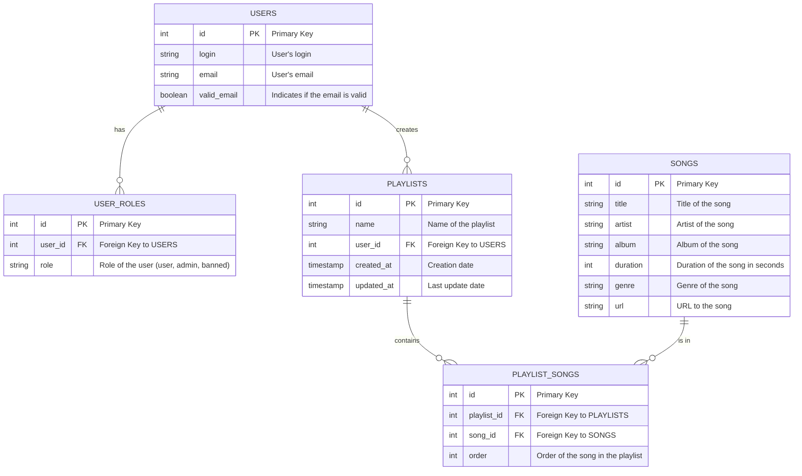

# Chartbox

Chartbox - это российский музыкальный стриминговый сервис, позволяющий пользователям искать и прослушивать различные музыкальные композиции, а также добавлять понравившиеся треки в свой профиль. В дополнение к основной функциональности, проект включает административную панель для управления пользователями и контентом.

## Содержание

- [Особенности](#особенности)
- [Технологии](#технологии)
- [Установка](#установка)
- [Использование](#использование)
- [Структура проекта](#структура-проекта)

## Особенности

- Поиск музыкальных композиций по названию и исполнителю.
- Возможность прослушивания треков через встроенный плеер.
- Пользовательские профили с сохраненными треками.
- Административная панель для управления пользователями, их ролями и контентом.
- Блокировка пользователей с возможностью их разблокировки.
- Реализованы функции авторизации и регистрации.
- Интуитивно понятный интерфейс, разработанный с использованием HTML, CSS и JavaScript.

## Технологии

- **Backend**: PHP
- **Frontend**: HTML, CSS, JavaScript
- **База данных**: MySQL
- **Библиотеки**:
  - `bcrypt` для хеширования паролей
  - `AJAX` для асинхронных запросов
- **Паттерны проектирования**: MVC (Model-View-Controller)

## Установка

1. Склонируйте репозиторий на свою локальную машину:
```bash
  git clone https://github.com/Pr0grammer-learner/ChartBox-music-website-.git
```
2. Перейдите в каталог проекта:
```bash
  cd ChartBox-music-website-
```
3. Импортируйте базу данных из database.sql в вашу MySQL базу данных.
4. Настройте файл db.php для подключения к вашей базе данных.
5. Запустите локальный сервер (например, с помощью XAMPP или MAMP).
6. Откройте в браузере http://localhost/chartbox/index.php.

## Использование
* Для регистрации нового пользователя перейдите на страницу регистрации и заполните необходимые поля.
* Войдите в систему, используя свои учетные данные.
* Исследуйте музыкальные композиции и добавляйте их в свой профиль.
* Если у вас есть административные права, вы можете управлять пользователями и контентом через административную панель.

## Структура проекта
```bash
chartbox/
├── admin_panel.php           # Административная панель
├── index.php                 # Главная страница
├── search.php                # Страница поиска
├── user_page.php             # Страница профиля пользователя
├── Obrs/                     # Директория с обработчиками (например, для выхода)
├── db.php                    # Файл подключения к базе данных
├── styles/                   # Директория со стилями CSS
├── icons/                    # Иконки и изображения
├── scripts/                  # Директория с JavaScript
└── database.sql              # SQL-скрипт для создания базы данных
```
## Маршруты

### Пользовательские маршруты

- **GET /index.php**: Главная страница с доступом к музыкальным композициям.
- **GET /search.php**: Страница поиска для поиска музыкальных треков.
- **GET /user_page.php**: Страница профиля пользователя с сохраненными треками.
- **GET /Obrs/logout.php**: Выход из системы.

### Административные маршруты

- **GET /admin_panel.php**: Главная страница административной панели.
- **GET /admin_panel.php?role=user**: Список пользователей.
- **GET /admin_panel.php?role=admin**: Список администраторов.
- **GET /admin_panel.php?role=banned**: Список заблокированных пользователей.

## База данных

### Диаграмма базы данных


